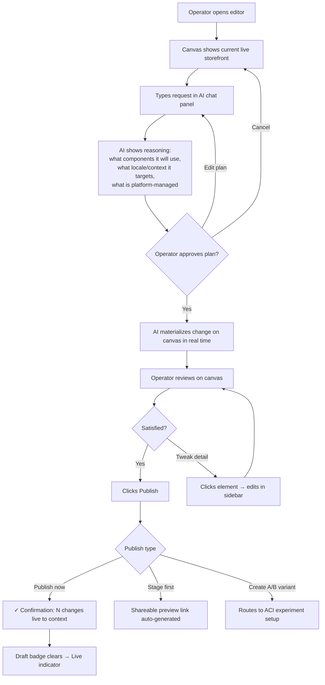
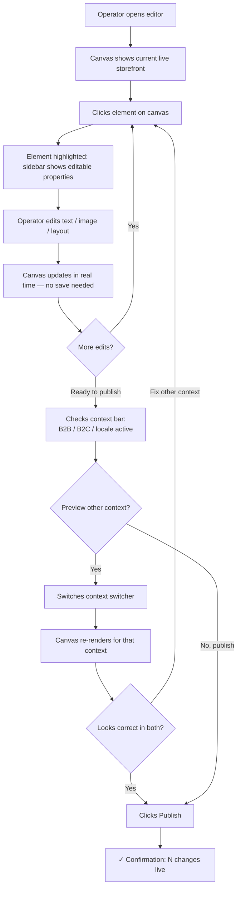
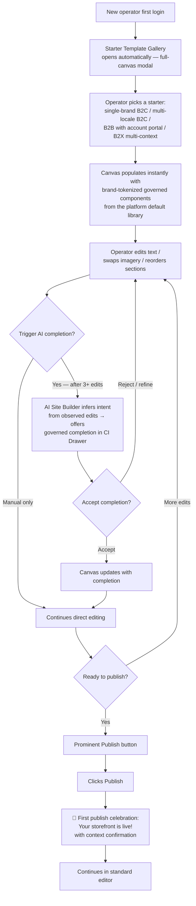

# UX Design Specification Tutorial

**Author:** Leandro
**Date:** 2026-05-04

---

<!-- UX design content will be appended sequentially through collaborative workflow steps -->

## Executive Summary

### Project Vision

An AI-native, composable storefront platform that closes the structural gap in the commercetools ecosystem — no first-party frontend exists today. The product operates on two layers simultaneously: a **storefront platform** that marketing and merchandising teams own and operate without writing code, and an **Autonomous Commerce Intelligence (ACI) layer** that replaces $350K–$1M/yr in external analytics tools (ContentSquare, Amplitude, Optimizely) through native commerce-context awareness unavailable to any external tool.

The one-line product truth: *The first commerce storefront that business users own, AI optimizes, and CFOs love — built natively for commercetools.*

### Target Users

This product has three distinct UX planes, each requiring its own design thinking:

| UX Plane | Who | Their Job |
|----------|-----|-----------|
| **Storefront consumers** | B2B buyers, B2C shoppers, dealer/distributor users | Buy, research, approve, transact |
| **Business operators** | Marketing, merchandising, content teams | Build, publish, and iterate on the storefront — without developer dependency |
| **Intelligence users** | Data science, CRO, Head of Merchandising, CMO | Read behavioral signals, run experiments, interpret ACI dashboards |

**Six customer segments** are served: Legacy-Trapped Enterprise (B2B), Digital-Native B2B Scale-up, AI-Forward Innovator, Multi-Brand B2C Enterprise, B2B2C Hybrid, and Unified Commerce Leader. The primary buyer personas within each enterprise are Head of Digital/VP Commerce, CTO/CIO, CMO, Head of Merchandising, CFO, and CRO/Data Science.

### Key Design Challenges

1. **Business user empowerment without chaos** — The product promises 80% of storefront changes without a developer, but must enforce brand guardrails and a two-zone governance model (Green Zone: AI composes freely from governed components; Red Zone: platform-protected commerce logic). The UX must make this boundary feel natural, not constraining.

2. **B2X context rendering** — The storefront must intelligently surface the right experience (B2B account dashboard with approval queues vs. B2C consumer catalog) based on buyer identity. The UX challenge is making context-switching seamless and predictable for both the end user and the operator configuring it.

3. **ACI dashboard unification** — Replacing ContentSquare + Amplitude + Optimizely means inheriting three distinct mental models for session analytics, product intelligence, and experimentation. The UX challenge is unifying these into one coherent experience without overwhelming non-data-science users.

4. **AI generation trust and inspectability** — The AI storefront generation feature is powerful but enterprises are risk-averse. The UX must make AI-generated drafts feel inspectable, correctable, and safe to publish — not a black box.

### Design Opportunities

1. **Commerce-context as a native UX advantage** — Every behavioral insight in ACI carries native commerce context (account tier, pricing, catalog, workflow stage). This enables surfaces no competitor can show: *"This B2B buyer hesitated here — their approval threshold is £5,000 and this order total was £4,900."* The UX should make this context legible and actionable at a glance.

2. **Progressive complexity model** — Business users start simple (visual editing, AI content generation); power users unlock experimentation and autonomous optimization. A well-designed progressive disclosure model makes the platform accessible to all buyer personas without sacrificing depth.

3. **AI as co-pilot, not autopilot** — The AI generation UX can build enterprise confidence through transparency: showing what it read from the data model, why it assembled components a certain way, and what the governance boundaries protect. This turns the two-zone governance model into a trust-building selling point rather than a limitation.

## Core User Experience

### Defining Experience

**Primary UX Plane: Business Operator** — marketing and merchandising teams building, managing, and iterating on the storefront without developer dependency.

The core user action is **publishing a storefront change** — the daily workflow that today requires a dev ticket. The design goal is to make this feel as immediate and confident as saving a document, not as fraught as deploying code. Every design decision in this plane should reduce the psychological distance between "editing" and "publishing."

Two actions are absolutely critical to get right:
1. **The first publish** — the moment a marketer makes a change and it goes live without engineering involvement. This is the platform's "aha moment" and the hinge of adoption.
2. **AI draft review and approval** — when an AI-generated storefront or component is returned, the operator must feel confident enough to publish it. Opacity at this moment kills adoption regardless of output quality.

### Platform Strategy

**Primary platform:** Web-based SaaS visual editor — desktop-first, as marketing and merchandising teams work at desks on complex, multi-component storefront decisions.

**Key platform consideration:** The storefront consumers (B2B buyers, B2C shoppers) experience the output on all devices including mobile. Operators therefore need **multi-context preview** — desktop, mobile, and crucially B2B vs. B2C rendering context — before publishing. Preview is not optional; it is a primary operator affordance.

**No offline requirement.** This is a connected SaaS tool; real-time data binding to commercetools project configuration is a core capability, not an enhancement.

### Effortless Interactions

The following operator actions must require zero friction — no modals, no confirmation dialogs, no dev handoffs:

- Adding, editing, or replacing text and imagery on existing components
- Swapping promotional banners and hero assets
- Reordering product grids and navigation items
- Publishing localized content variations across locales
- Launching a campaign landing page from an existing template
- Previewing how any page renders in B2B vs. B2C context

These are the daily-frequency actions. If any of them require more than three interactions, the product fails its core promise.

### Critical Success Moments

1. **Zero-ticket publish** — A marketer makes a change and it is live without a Jira ticket filed. The first time this happens is the product's conversion event; the UX should make it feel inevitable, not remarkable.

2. **Starter template → AI completion → publish in under an hour** — Operator picks a starter template from the gallery (or starts from a populated canvas via migration / prior published state); operator edits a few elements; AI Site Builder offers governed completions for the remaining sections; operator accepts/refines and publishes. Sub-60-minute start-to-finish is the target; the UX must support this pace without forcing the operator to "trust blindly."

3. **B2X preview confidence** — Operator sees exactly how the same page renders for a B2B buyer and a B2C consumer before publishing. This moment — "one page, two perfect experiences" — is the B2X moat made visible.

4. **First autonomous experiment approval** — ACI surfaces a behavioral signal; AI proposes test variants; operator approves the experiment launch in the same surface where they do visual editing. Experimentation stops requiring a developer the moment this flow works seamlessly.

### Experience Principles

1. **Publish confidence over feature depth** — Every design decision should reduce the psychological barrier between editing and publishing. Operators must trust the governance guardrails, not fear them. The two-zone model (Green/Red) should feel like a safety net, not a cage.

2. **Context always visible** — Which commerce model? Which locale? Which customer group? These are never ambiguous. Commerce context is a permanent, visible affordance — not buried in settings or revealed only on preview.

3. **AI explains itself** — Every AI-generated output shows its reasoning: what data it read from the project configuration, what it optimized for, what the governance layer is protecting. Transparency earns trust with cautious CTOs and makes AI feel like a colleague, not a black box.

4. **Progressive depth without progressive friction** — A marketer updating a headline and a CRO configuring a multivariate experiment are both operators. The interface never makes the marketer wade through experimentation UI to complete a simple content edit. Depth is available; it is never in the way.

## Desired Emotional Response

### Primary Emotional Goals

The product must deliver a fundamental emotional transformation for business operators. The current state — filing dev tickets for every storefront change — produces feelings of blockage, dependency, and frustration. The target state is ownership, confidence, and flow.

| Current feeling | Target feeling |
|-----------------|----------------|
| Blocked — "I have to wait for engineering" | **Empowered** — "I own this storefront" |
| Anxious — "what if I break something?" | **Confident** — guardrails catch me, I can publish freely |
| Dependent — "I need to explain my idea to a developer" | **Capable** — I act on my ideas directly |
| Frustrated — slow time-to-market | **In flow** — the tool disappears, the work happens |
| Skeptical of AI — "black box, I don't trust it" | **Trusting** — I can see what it did and why |

### Emotional Journey Mapping

- **First use:** Nervous → Guided → *"That was easier than I expected"* (surprise delight)
- **First publish:** Tentative → *"It's live? Already?"* → Proud
- **Working with AI drafts:** Curious → Impressed → *"It read my catalog?"* → Trusting → In control
- **B2X preview:** Uncertain → *"One page, two experiences — and I configured that"* → Capable
- **Error / governance boundary:** Startled → Safe → Clear path forward (never panicked, never lost)
- **Returning daily:** Confident → In flow → Accomplished

### Micro-Emotions

- **Confidence over anxiety** — The two-zone governance model must feel like a safety net, not surveillance. Operators should feel free to experiment because the platform catches mistakes, not because they fear making them.
- **Ownership not just access** — The emotional difference between "I'm allowed to edit this" and "I own this storefront" is significant. Design language, copy, and information architecture should reinforce ownership at every turn.
- **Trust in AI through transparency** — Operators don't need to love AI; they need to trust it enough to publish. Trust comes from seeing what the AI read, what it decided, and what it left for humans to control.
- **Accomplishment not just completion** — Finishing a task should feel like a small win, not just a task closed. Publish confirmations, campaign go-live moments, and experiment launches are opportunities for meaningful positive reinforcement.

### Design Implications

- *Empowerment* → Prominent, accessible publish action; progress visible in real time; no hidden approval steps for Green Zone changes
- *Confidence* → Visual confirmation of governance boundaries before publishing; clear undo/rollback capability always visible
- *Trust in AI* → AI panel surfaces: "I read [these components] from your catalog" + "I optimized for [this goal]" + "Red Zone components are platform-managed"
- *In flow* → Contextual tools appear when needed; no modal interruptions for routine actions; keyboard shortcuts for power users
- *Accomplishment* → Meaningful publish confirmation ("Your campaign page is live for 3 locales"); experiment launch celebration moments

**Emotions to actively design against:**
- **Overwhelm** — too much UI surface, too many options visible at once
- **Ambiguity** — not knowing which context (locale, B2B/B2C, customer group) a change applies to
- **Regret** — publishing something that breaks the experience because guardrails weren't visible
- **Learned helplessness** — falling back to "I'll just file a ticket" because the interface is unclear

### Emotional Design Principles

1. **Safety enables freedom** — Operators publish confidently because governance is visible and trust is earned by the platform, not demanded from the user. Show the safety net; don't hide it.
2. **Ownership is felt, not stated** — Every surface should reinforce that the operator is the author of this storefront — through language ("your storefront"), through control affordances, and through the absence of friction on routine actions.
3. **AI earns trust incrementally** — Don't ask operators to trust AI at full autonomy from day one. Each AI action should be legible, reviewable, and correctable — trust accumulates through successful interactions, not through onboarding promises.
4. **Celebrate the moments that matter** — The first publish, the first AI draft deployed, the first experiment approved — these are emotional milestones. Design them as celebrations, not just confirmations.

## UX Pattern Analysis & Inspiration

### Inspiring Products Analysis

**Webflow — Visual editing non-developers trust**
- Canvas-as-truth: the editor view IS the storefront view — no preview mode disconnect
- Locked/editable component slots: editable zones and locked zones in one component — the visual metaphor for Green/Red zone governance
- Instant staging → publish: two-click flow, no deploy pipeline visible to editors

**Shopify Online Store Editor — Commerce-native publishing**
- Sections/blocks mental model: merchants think in named sections, not code
- Non-destructive draft saves: explore freely, publish is deliberate
- Sidebar-canvas split: config in sidebar, live impact on canvas — no modal dialogs
- Context switcher: device preview extended to B2B/B2C/locale dimensions

**Figma — Component governance and variant mental model**
- Component instances with locked structure, editable properties — maps to governed AI-generated components
- Variants panel: one component, multiple defined states — maps to B2X rendering
- "Detach from component" as explicit governance break — deviation is deliberate
- Progressive disclosure by selection: sidebar adapts to selected element

**Lovable / Bolt / v0 / Framer AI — AI-first creation tools**
- Chat panel alongside live preview: natural language drives canvas changes in real time — no mode switching
- Reverse creation flow: describe → AI assembles → operator refines → publish (not: browse → assemble → configure → publish)
- Conversation history as undo/restore: every AI action is a revertible turn
- Immediate shareable preview link on draft save
- Power users go deeper via conversation, not more UI panels

### Transferable UX Patterns

| Pattern | Source | Application |
|---------|--------|-------------|
| Sidebar-canvas split | Shopify | Visual editor layout: config sidebar, live canvas |
| Sections/blocks vocabulary | Shopify | Operator mental model for storefront composition |
| Non-destructive draft saves | Shopify | Draft mode default; publish is explicit |
| Commerce context preview | Shopify (extended) | B2B/B2C/locale as primary preview dimensions |
| Locked component slots | Webflow | Green/Red zone governance made visually explicit |
| Canvas-as-truth | Webflow | Editor view = consumer view, always |
| Staging → shareable preview link | Webflow + Lovable | Auto-generated preview link on draft save |
| Variants model | Figma | B2B/B2C/locale as component variants |
| Progressive disclosure by selection | Figma | Sidebar adapts to selected component context |
| AI chat alongside live canvas | Lovable | Natural language drives real-time canvas changes |
| Reverse creation flow | Lovable | Describe intent → AI assembles → refine → publish |
| Conversation history = audit trail | Lovable (adapted) | Every AI action logged with operator request context |
| Reasoning-before-action | Reverse of current AI tools | AI surfaces intent before generating — trust earns |
| Draft as A/B variant | Put to other uses | Publish Variant A + B simultaneously for ACI tests |

### Anti-Patterns to Avoid

- **Modal-heavy configuration** (legacy CMSes) — every property change triggers a dialog, killing flow for routine edits
- **Preview-mode disconnect** — editing in a backend view that looks nothing like the storefront; breaks canvas-as-truth
- **Role-gated UI** — different UI surfaces per permission level creates confusion; use progressive disclosure by context instead
- **Flat component governance** (Builder.io) — no visible boundary between editable zones and locked commerce logic; operators over-trust or under-trust AI output
- **Publish = deploy anxiety** — making publish feel like a technical deployment event creates hesitation
- **Generate-then-explain AI** — AI acts first, explains after; enterprise operators need reasoning before action to build trust
- **More power = more UI panels** — power users in AI-first tools go deeper via conversation, not via more complex UI surfaces

### Design Inspiration Strategy

**Adopt directly:**
- Sidebar-canvas split with real-time preview (Shopify)
- Non-destructive draft saves with explicit publish (Shopify)
- Locked/editable slot visual model for Green/Red governance (Webflow)
- AI chat panel alongside live canvas (Lovable)
- Reverse creation flow: describe → assemble → refine → publish (Lovable)

**Adapt for our enterprise context:**
- Shopify context switcher → extend to B2B/B2C/locale/customer group as primary preview dimensions
- Figma variants panel → B2X rendering configuration per component
- Lovable conversation history → enterprise audit trail (every AI action logged with operator request context)
- Lovable deploy URL → shareable stakeholder preview link auto-generated on draft save
- Draft/publish model → doubles as A/B variant creation feeding directly into ACI experiments

**Avoid:**
- Modal-heavy configuration workflows
- Role-gated UI in favor of progressive disclosure by selection
- Making publish feel like a deployment event
- AI that acts before explaining its reasoning

## Design System Foundation

### Design System Choice

**Two distinct design system contexts exist in this product:**

| Context | Audience | Design Ownership |
|---------|----------|-----------------|
| **Operator UI** (the editor itself) | Business operators — commercetools customers | commercetools brand / enterprise SaaS conventions |
| **Consumer storefront** (the output) | B2B buyers, B2C shoppers | Each customer's own brand — fully customizable per deployment |

This specification covers the **Operator UI** design system. The consumer storefront design system is a separate concern handled by the component library and theming engine.

**Selected approach: Headless primitives + commercetools brand tokens**

Radix UI headless component primitives as the foundation, layered with commercetools design tokens and custom styling — the architecture used by Vercel, Linear, and modern enterprise SaaS products.

### Rationale for Selection

The visual editor operates across two interaction layers with different UX demands:
- **Canvas / AI chat panel / context menus / floating toolbars** — fluid, creative-tool-like UI requiring maximum flexibility and composability
- **Sidebar / configuration panels / data tables** — dense enterprise SaaS UI with rich component coverage

A headless primitive approach (Radix UI) serves both layers: fully composable for the fluid canvas layer, with Ant Design or MUI components pulled in selectively for the densest data management panels where component coverage matters more than bespoke interaction.

Extending commercetools' existing Merchant Center design system was considered — operators benefit from visual continuity across the platform — but Merchant Center is optimized for data-management UI, not visual canvas editing. The headless approach achieves visual continuity through shared brand tokens without inheriting architectural constraints.

### Implementation Approach

- **Foundation:** Radix UI primitives — accessible by default, unstyled, fully composable
- **Visual identity:** commercetools design tokens (color, typography, spacing, elevation)
- **Selective imports:** Ant Design or MUI for complex data panel components (tables, form builders, data grids) where speed of implementation outweighs customization need
- **Canvas layer:** Custom-built interaction components (drag handles, floating panels, selection states, inline AI chat) — no existing library serves this pattern adequately

### Customization Strategy

- Design tokens defined at the platform level — operators never see or touch the design system; their brand lives in the consumer storefront layer
- Component slot model: the operator UI uses platform brand; the canvas preview dynamically renders the customer's brand
- Accessibility baseline: WCAG 2.1 AA compliance through Radix UI primitives — enterprise procurement requirement
- Dark mode support deferred to Phase 2 — operator UI is desktop-primary in controlled lighting environments

## Operator Plane: Detailed Interaction Design

### 2.1 Defining Experience

The defining interaction for the commercetools Next-Gen Frontend Business Operator plane:

> **"I described what I needed, it appeared on my storefront canvas, and I published it without filing a single ticket."**

The core experience is the **natural language → canvas materialization → publish** loop. Two complementary modes form the complete interaction:

| Mode | When | Feel |
|------|------|------|
| **AI creation path** | New pages, sections, campaigns | Describe → watch it appear on canvas |
| **Direct edit path** | Daily content updates, tweaks | Click → change → publish |

Both paths end at the same place: a deliberate, confident publish. The AI creation path is the defining experience — the moment that surprises and converts. The direct edit path handles daily frequency. Together they form one coherent surface with no mode switching.

### 2.2 User Mental Model

**Current mental model (the pain):**
Operators describe their idea in a ticket → a developer interprets and builds it → feedback loop → days or weeks pass.

**Target mental model (the unlock):**
"I'm talking directly to my storefront — like a capable colleague who makes changes in real time while I watch, and who knows my entire catalog, my B2B pricing tiers, my brand guidelines, and my governance rules."

The Lovable/Cursor natural language mental model is the right frame — operators with any exposure to AI tools will recognize and reach for conversation once they see it works on their actual storefront.

**Where confusion will occur (design must pre-empt):**
- "Does this change go live immediately or is it a draft?" — draft state must always be explicit
- "Which context am I editing — B2B or B2C?" — active context must always be visible
- "What can the AI change vs. what's locked?" — governance boundaries must be intuitive, not instructed

### 2.3 Success Criteria

- AI draft is ≥90% ready to publish without manual tweaks for standard section types
- Time from natural language request to "ready to publish" under 15 minutes for a standard section
- Operator sees every change on the canvas before committing — no blind trust required
- Governance is invisible unless crossed — normal actions produce zero warnings
- First-time operators successfully publish without reading documentation

### 2.4 Novel UX Patterns

| Interaction | Pattern type | Approach |
|-------------|-------------|----------|
| AI chat → canvas changes | Novel for commerce operators | Use the Lovable mental model — familiar from consumer AI tools; brief onboarding moment needed |
| Sidebar-canvas split | Established | Adopt directly from Shopify/Webflow — operators recognize it immediately |
| B2X context preview | Novel — no competitor offers this | Introduce as a context switcher (established metaphor) applied to a new dimension |
| Draft → publish flow | Established | Adopt from Shopify — operators intuitively understand it |
| Green/Red zone governance | Novel framing, familiar concept | Use the "locked component" metaphor from Figma — no new concept, applied to commerce logic |

### 2.5 Experience Mechanics

**AI Creation Path — Step by step:**

**1. Initiation**
Operator opens the visual editor. Canvas shows the current live storefront. AI chat panel is open by default with a soft prompt: *"What would you like to create or change?"* No modal, no wizard — canvas and chat are both immediately present.

**2. Interaction**
- Operator types: *"Create a summer campaign hero for our DACH B2C segment — use the new seasonal palette"*
- AI responds before acting: *"I'll assemble a hero section using your B2C storefront layout, apply the seasonal color tokens from your brand library, and set the locale to DE/AT/CH. Shall I proceed?"*
- Operator approves → change materializes on canvas in real time, animated into place
- Operator can click any canvas element to fine-tune in the sidebar — AI path and direct edit path are seamlessly interchangeable at any moment

**3. Feedback**
- Canvas reflects every change as it happens — no "applying…" loading screen
- Context bar (persistent top bar) shows: `[B2C] [DE/AT/CH] [Summer Campaign Draft]`
- Draft badge: "3 unpublished changes" — informational, not alarming
- Preview link auto-generates: *"Share this draft"* — one click to send for stakeholder review on any device

**4. Completion**
- Operator clicks **Publish**
- Confirmation: *"Published to DACH B2C storefront — 3 changes live"*
- Branching option: *"Create A/B variant for ACI experiment"* — one click to route into experimentation
- Secondary option: *"Publish to staging first"* — always available for enterprise approval workflows, never the default

## Visual Design Foundation

### Core Visual Principle

The Operator UI chrome (sidebar, toolbar, top bar, panels) uses **commercetools Merchant Center design tokens exactly**. The canvas area renders the **customer's own storefront brand**. This contrast enforces the product's core promise visually — operators manage the storefront; their customers' brand lives in the canvas. The boundary between operator chrome and customer canvas is always legible.

### Color System

*Approach: Inherit commercetools Merchant Center design tokens directly — no new colors introduced for the Operator UI chrome.*

| Role | Token | Usage |
|------|-------|-------|
| **Primary action** | Merchant Center primary blue | Publish button, AI chat send, primary CTAs |
| **Surface / background** | Merchant Center app shell background | Editor chrome, sidebar, panels |
| **Canvas boundary** | Merchant Center elevation / border token | Separates operator chrome from customer brand canvas |
| **Success / published** | Merchant Center success green | Publish confirmation, live indicator |
| **Warning / draft** | Merchant Center warning amber | Unpublished changes badge |
| **Governance / locked** | Merchant Center neutral/muted | Red Zone component indicators — muted, not alarming |
| **AI accent** | Low-opacity wash of primary brand color | AI chat panel, AI-generated content indicators exclusively |
| **Destructive** | Merchant Center error red | Delete, detach-from-component, irreversible actions only |

**Deliberate addition — AI interaction tint:** A subtle tint used exclusively on the AI chat panel and AI-generated content indicators. Creates a lightweight visual language: operators instantly recognize "this came from AI" vs. "this is platform UI." Implemented as a low-opacity wash of the primary brand color — not a new color, so it stays within the Merchant Center design language.

*Exact hex values: sourced from commercetools' internal design token library at implementation time. This spec defines semantic roles.*

### Typography System

*Approach: Match Merchant Center typeface and type scale exactly — geometric sans-serif (Inter or equivalent), optimized for readability at small sizes across long sessions.*

| Level | Usage | Scale |
|-------|-------|-------|
| **Heading / page title** | Editor section names, panel headers | Merchant Center H2/H3 equivalent |
| **Label** | Sidebar property labels, toolbar items | Tight, medium weight — Merchant Center label style |
| **Body** | AI chat responses, description text | Merchant Center body — optimized for readability |
| **Caption / meta** | Context bar indicators (B2B/B2C/locale), timestamps | Merchant Center caption — small but legible |
| **Code / technical** | Governance zone labels, component IDs | Monospace for technical strings |

*Type scale values: inherited directly from Merchant Center tokens. No custom scale introduced.*

### Spacing & Layout Foundation

*Approach: 8px base grid, inherited from Merchant Center conventions.*

| Element | Spacing principle |
|---------|------------------|
| **Sidebar width** | Fixed — matches Merchant Center navigation panel width |
| **Panel gutters** | 16px / 24px inner padding — consistent with Merchant Center data panels |
| **Canvas margin** | Breathing room between chrome and canvas — visually separates operator UI from customer brand |
| **AI chat panel** | Fixed-width right panel or bottom panel — slides in without reflowing the canvas |
| **Context bar height** | Compact — matches Merchant Center top bar height |
| **Component spacing in canvas** | Inherits customer's own brand spacing — platform does not override |

**Layout density:** Match Merchant Center — efficient and data-dense, not airy. Operators are power users comfortable with information density; excess padding wastes screen real estate on a canvas editor.

### Accessibility Considerations

- WCAG 2.1 AA baseline — inherited from Merchant Center compliance
- AI tint applied near text: maintain AA contrast minimum even at low opacity
- Canvas preview area: operator UI accessibility-exempt — renders the customer's storefront; their own compliance is their responsibility
- Focus ring styles: inherit Merchant Center — keyboard navigation parity with existing platform

## Performance Design Budgets

The PRD defines hard performance targets (NFR1, NFR2, NFR3, NFR4, NFR5, NFR6) that the UX must accommodate. These are not engineering-only concerns — they shape loading states, skeleton design, progressive disclosure, and optimistic UI patterns. Designers must know the timing budget they design *around*.

### Budget Table

| NFR | Action | Budget | Designer's job |
|---|---|---|---|
| **NFR1** | Editor user actions (component placement, property edits, canvas navigation) | <500 ms visible response | No loading states for routine actions; canvas updates feel instant. Optimistic UI on every interaction; reconcile silently if the server disagrees. |
| **NFR2** | AI completion job (intent inference + governed completion offer applied to canvas) | <30 s end-to-end; streaming progress shown after 2 s | Skeleton overlay on the affected section after 2 s; live token stream visible in the CommerceIntelligenceDrawer; "Cancel completion" available throughout. Never a blocking spinner. |
| **NFR3** | Publish action (governance validation + atomic deployment, storefronts ≤500 KB) | <15 s | PublishAction shows progressive states: validating → deploying → live. Confirmation toast names contexts affected. No modal lock during publish — canvas remains read-only-visible. |
| **NFR4** | Storefront page load (Core Web Vitals — consumer-facing) | LCP <2.5 s mobile / <1.5 s desktop; CLS <0.1; INP <200 ms | Canvas preview iframe must report CWV scores live; ACI script adds 0 ms measurable LCP impact (FR25). Designers spec image sizes / layout boundaries that prevent CLS regressions in Green Zone components. |
| **NFR5** | ACI heatmap overlay loads after canvas section navigation | <3 s | Show a low-opacity loading wash on the overlay layer only; canvas remains interactive. Cached overlay states surface immediately on revisit; cold loads progress within 3 s. |
| **NFR6** | commercetools API sync (catalog, pricing, inventory) propagates to live storefronts | <60 s | Context bar surfaces a "syncing" indicator when content is in flight; timestamps are honest about staleness. Designers do not surface stale data without provenance. |

### Loading-State Patterns

| Duration of work | Pattern |
|---|---|
| **<200 ms** | No state — change appears instantly |
| **200–2000 ms** | Optimistic UI (apply immediately, reconcile if server disagrees); subtle inline indicator only if reconcile happens |
| **2–15 s** | Skeleton overlay scoped to the affected section; rest of canvas remains interactive; cancel/abort always available |
| **15–30 s** | Streaming progress (token-by-token for AI completion, deploy-stage-by-stage for publish); skeleton + status text |
| **>30 s** | Treat as failure; surface error with retry. NFR2 / NFR3 budgets are hard ceilings, not aspirations. |

### Anti-Patterns to Avoid

- **Full-page spinners** — every loading state is contextual and inline; never blocks the entire canvas
- **"Are you sure?" gates on routine actions** — adds latency the user feels as friction; reserve for destructive only
- **Hidden loading states** — every >200 ms operation announces itself; silence reads as "stuck"
- **Canvas re-renders for property edits** — property-level changes update only the affected element; full canvas re-render is reserved for context switches and template applies
- **AI completion without streaming** — the 30 s budget is too long without visible progress; streaming starts at 2 s and never lapses for >5 s without a token

## Design Direction Decision

### Design Directions Explored

Six directions were explored and visualized in `ux-design-directions.html`. Each was evaluated against five criteria: AI centrality, canvas real estate, operator familiarity, new-user confidence, and power-user appeal.

| # | Direction | Defining characteristic | Strongest for |
|---|-----------|------------------------|---------------|
| 1 | **Merchant Center Native** | Matches existing MC shell exactly — left rail nav, right sidebar, top context bar | Zero-friction adoption by existing MC operators |
| 2 | **Canvas First** | Canvas fills screen, floating toolbar + panels, AI as a floating button | Power users who want maximum immersion |
| 3 | **Split Studio** | Lovable-inspired — AI chat left, live canvas right, reasoning-before-action | AI-first creation workflows, new page/section generation |
| 4 | **Command Center** | Dark mode, ⌘K command palette, keyboard-primary, dense sidebar | CRO/data-fluent power users |
| 5 | **Context Dashboard** | All B2X contexts visible in left panel simultaneously | Multi-market operators managing B2B + B2C + locales |
| 6 | **Guided Creation** | Step-by-step wizard, AI generates preview at each step | Onboarding, first-time use, new page creation |

### Chosen Direction

**Hybrid: Merchant Center Native shell + expandable Split Studio AI panel**

The editor adopts Direction 1 (Merchant Center Native) as the default operating mode — preserving the familiar MC shell that eliminates operator learning curve. The Direction 3 (Split Studio) AI chat panel is available as an expandable right panel, surfaced when the operator invokes AI generation.

This means:
- **Default state:** Direction 1 layout (nav rail + canvas + property sidebar) — operators feel at home from day one
- **AI invoked:** The property sidebar transitions to an AI chat panel — conversation drives canvas changes in real time; the split-studio dynamic activates within the familiar MC shell
- **Power users:** Direction 4's ⌘K command palette is available as a keyboard shortcut layer on top of the base layout
- **Multi-market operators:** Direction 5's context switcher pattern is adopted for the context bar — contexts are explicitly named and switchable, with their live/draft state always visible

Direction 6 (Guided Creation) is not the primary shell. Its onboarding intent is fulfilled by the **Starter Template Gallery** (FR76 / Story 3.0): on first canvas open and on each new-page action, operators choose from a curated gallery of starter templates that populate the canvas with brand-tokenized governed components — no wizard, no AI cold-start. From the populated canvas, the warm-start AI completion flow (FR7) takes over: operator edits trigger AI completion offers for the remaining sections.

### Design Rationale

The hybrid resolves the primary tension in the operator audience: **existing commercetools users want zero re-learning; AI-forward innovators want AI front-and-center.** A single direction cannot serve both. The hybrid gives existing operators a familiar entry point while making the AI creation capability immediately accessible without requiring operators to change tools.

The Direction 1 foundation also minimizes engineering risk — building within the established MC design system rather than introducing a new visual language.

### Implementation Approach

- **Phase 1 (MLP):** Direction 1 base layout with the CommerceIntelligenceDrawer as a collapsible right drawer (Create mode primary, Optimize mode unlocked when a page accumulates sufficient behavioral data). Property sidebar and Drawer share the same 240px right column — toggle between them.
- **Phase 2:** Full split-studio mode available as a user preference — operators who work AI-first can switch to the persistent split layout.
- **Phase 3:** Direction 5 context dashboard as a dedicated multi-market view for operators managing 5+ contexts simultaneously.
- **⌘K command palette:** Available from Phase 1 as a power-user shortcut layer; does not change the base layout.

## User Journey Flows

### Journey 1: AI Creation Flow

The defining experience — natural language request to live publish.



### Journey 2: Direct Edit Flow

Daily frequency — click-to-edit with B2X context verification before publish.



### Journey 3: First Publish — Onboarding Milestone

The emotional conversion moment — skeptic to owner. Bootstrap is owned by the **Starter Template Gallery** (FR76); AI completion (FR7) layers on top of the populated canvas.



### Journey Patterns

**Navigation patterns:**
- Canvas always visible — no full-screen modal interrupts editing mid-flow
- Context bar persists across all journeys — B2X/locale always legible
- Sidebar is contextual — transitions seamlessly between property panel (direct edit) and CommerceIntelligenceDrawer (Create mode warm-start completion / Optimize mode recommendations)

**Decision patterns:**
- AI always shows reasoning before acting — operator approves before canvas changes (Journey 1)
- Publish is always explicit and deliberate — never auto-publishes to live
- B2X context preview surfaced proactively before publish — not buried in settings

**Feedback patterns:**
- Canvas updates in real time on every change — no "applying..." loading states
- Draft badge count ("3 unpublished changes") — informational, non-alarming
- Publish confirmation names specific contexts affected ("published to B2C DE/AT/CH")
- First publish receives a celebration moment — not just a toast notification

### Flow Optimization Principles

1. **Minimum path to publish = 3 interactions** — pick starter template (or open populated canvas) → edit and accept AI completion → publish
2. **Error recovery stays in context** — no navigation away from canvas to fix issues; corrections happen inline
3. **Governance encountered naturally** — locked badge in sidebar when component is Red Zone; never a blocking error state
4. **B2X preview is one click from any state** — context switcher always visible in context bar, never more than one click away

## Component Strategy

### Design System Components

The following components are available from Radix UI + Merchant Center tokens and should be used directly without custom work:

| Category | Components |
|----------|-----------|
| **Actions** | Button, IconButton, DropdownMenu |
| **Forms** | Input, Textarea, Select, Checkbox, RadioGroup |
| **Overlays** | Dialog, Sheet (drawer), Tooltip, Popover |
| **Navigation** | Tabs, NavigationMenu, Breadcrumb |
| **Feedback** | Toast, Badge, Progress |
| **Layout** | Separator, ScrollArea, Accordion |
| **Data** | Table, DataGrid |

### Custom Components

Ten components are unique to this product with no adequate equivalent in the design system.

#### Phase 1 — MLP Critical

**StarterTemplateGallery**
- *Purpose:* Bootstrap surface (FR76 / Story 3.0) — populates a new tenant's canvas with brand-tokenized governed components on Day 1, before AI completion is useful. Closes the cold-start gap created by FR7's warm-start completion model.
- *Anatomy:* Full-canvas modal on first open + accessible thereafter via "Start from template" action and page-create menu. Card grid showing each starter (single-brand B2C, multi-locale B2C, B2B with account portal, B2X multi-context) with name, description, preview thumbnail, included page count, and B2X context coverage chips.
- *States:* gallery (default), preview-hover, applying (skeleton overlay on canvas), applied
- *Key behavior:* Selection validates that every component referenced by the template exists in the tenant's published library (default library per FR77 + tenant additions); missing components surface as inline warnings and block "Apply template" until resolved. On apply, the canvas populates with brand-tokenized Green Zone components ready for operator edits and subsequent AI completion (FR7).

**StorefrontCanvas**
- *Purpose:* Main editing surface — renders the customer's live storefront with selection overlay controls
- *States:* idle, element-selected, AI-generating, read-only (published view), empty (deep-links to StarterTemplateGallery via "Start from template" CTA when no draft or published state exists)
- *Key behavior:* Click-to-select any element; selection triggers sidebar property panel; canvas is always the live truth — no preview mode switch
- *Accessibility:* Keyboard navigable section-by-section; selected element announced to screen reader

**ContextBar**
- *Purpose:* Persistent top bar showing active B2X context, locale, customer group, and draft state
- *Anatomy:* Commerce context chips (B2B/B2C) + locale chip + customer group chip + draft indicator + share link
- *States:* all live, has draft changes, generating, staging
- *Key behavior:* Click any chip to switch context; canvas re-renders immediately; switching never discards unsaved draft changes

**ComponentSlot**
- *Purpose:* Visual overlay on canvas elements showing editability vs. governance lock
- *Variants:* Green Zone (editable — dashed border on hover), Red Zone (locked — muted lock icon + "platform-managed" tooltip)
- *States:* idle, hover, selected, AI-modified (subtle AI tint indicator)
- *Key behavior:* Green Zone click → opens property sidebar; Red Zone click → shows locked tooltip explaining what the platform manages and why

**CommerceIntelligenceDrawer** *(supersedes the original `AIPanel` naming)*
- *Purpose:* The canvas-anchored AI surface — single drawer that operates in two automatically-switched modes based on whether the active page has sufficient behavioral data: **Create mode** (AI Site Builder — observes operator edits and offers governed completions, FR7 / Epic 4) and **Optimize mode** (canvas-anchored behavioral recommendations from the AI Experience Engine, FR56 / Epic 8).
- *Anatomy:* Mode badge (Create / Optimize) + reasoning surface (AIReasoningCard in Create, ConfidenceCard in Optimize) + action buttons + scoped to the page currently being edited. Mode switches automatically when the page accumulates enough sessions/experiments to support recommendations; operator can manually toggle.
- *States:* idle (collapsed), Create-active (warm-start completion observing edits), Optimize-active (recommendations available), generating, error
- *Key behavior:* Slides in as right drawer; toggles with property sidebar; persists conversation/recommendation history per session. Drawer never mode-switches mid-action — completion-in-progress completes before Optimize mode takes over.

**AIReasoningCard** *(Create mode — AI Site Builder)*
- *Purpose:* Pre-action transparency card for warm-start completion — AI shows its plan before making any canvas changes
- *Anatomy:* "What I'll do" description + components list + governance scope + Approve / Edit plan / Cancel actions
- *States:* pending approval, approved (collapses to summary), edited, cancelled
- *Key behavior:* AI NEVER applies canvas changes until operator clicks Approve — this is the core trust-earning pattern in Create mode

**ConfidenceCard** *(Optimize mode — AI Experience Engine)*
- *Purpose:* Recommendation transparency card for behavioral-data-driven optimization — surfaces a ranked recommendation with expected outcome, statistical confidence, and Horizon badge (⚡ Quick Win / 📈 Long Game)
- *Anatomy:* Recommendation summary + behavioral evidence brief + expected outcome + confidence interval + Horizon badge + Apply (with progressive rollout 5/25/50/100%) / Defer / Reject actions
- *States:* pending review, applied (rolling out), rolled-back, retired (added to "Tried and Retired" library)
- *Key behavior:* Apply triggers progressive traffic gates with rollback alerts (FR59); rejected/rolled-back recommendations classify into the failure taxonomy (FR60) and feed the "Tried and Retired" library

**PublishAction**
- *Purpose:* Publish button + confirmation flow with context specifics
- *Anatomy:* Primary publish button + dropdown with "Stage first" and "Create A/B variant" options + confirmation toast naming affected contexts
- *States:* no changes (disabled), has changes (enabled), publishing (loading), published (confirmation)
- *Key behavior:* Confirmation toast reads "Published to B2C DE/AT/CH — 3 changes live" — never generic "Published successfully"

**ContextSwitcher**
- *Purpose:* B2X/locale context switcher in the context bar
- *Anatomy:* Segmented control or dropdown listing all configured contexts with live/draft status per context
- *States:* single context (display only), multi-context (switcher active)
- *Key behavior:* Switching context re-renders canvas; draft changes preserved per-context independently

**GovernanceBadge**
- *Purpose:* In-sidebar indicator for Red Zone (platform-managed) properties
- *Anatomy:* Lock icon + "Platform-managed" label + optional "Why?" tooltip
- *States:* locked (default), hovered (shows explanation tooltip)
- *Key behavior:* Never alarming — muted neutral styling; tooltip explains the protection, does not block the operator

**FirstPublishCelebration**
- *Purpose:* Onboarding milestone moment — emotional design for first publish; the conversion event that turns a skeptic into an owner
- *Anatomy:* Full-canvas overlay with confirmation + context list + encouraging copy + "continue editing" CTA
- *States:* appears once per operator account on first publish only
- *Key behavior:* Auto-dismisses after 4 seconds or on click; never shown again after first occurrence

#### Phase 2

**B2XPreviewSplit**
- *Purpose:* Side-by-side canvas showing B2B rendering left, B2C rendering right simultaneously
- *Anatomy:* Split canvas with context labels + synchronized scrolling + change indicators per context
- *Key behavior:* Changes applied to both contexts; operator can scope to "B2B only" or "all contexts"

### Component Implementation Strategy

- All custom components built on Radix UI primitives — accessibility compliance inherited, not retrofitted
- commercetools design tokens applied as CSS custom properties — no hardcoded values in component code
- ComponentSlot and GovernanceBadge encode the Green/Red Zone governance model visually — these are the components that make the two-zone architecture tangible to operators
- CommerceIntelligenceDrawer, AIReasoningCard, and ConfidenceCard are decoupled from specific AI model implementations — they render reasoning/recommendation payloads supplied by the AI service layer

### Implementation Roadmap

| Phase | Components | Blocking journey |
|-------|-----------|-----------------|
| **MLP (Phase 1)** | StarterTemplateGallery, StorefrontCanvas, ContextBar, ComponentSlot, CommerceIntelligenceDrawer (Create mode), AIReasoningCard, PublishAction, ContextSwitcher, GovernanceBadge, FirstPublishCelebration | All three critical journeys + greenfield bootstrap + first-publish conversion moment |
| **MLP (Phase 1+)** | ConfidenceCard, CommerceIntelligenceDrawer Optimize mode | AI Experience Engine MVP recommendations (Epic 8) |
| **Phase 2** | B2XPreviewSplit, ⌘K CommandPalette | Multi-market operators + power users |
| **Phase 3** | MultiContextDashboard (Direction 5 layout) | Multi-brand B2C enterprise segment |

## UX Consistency Patterns

### Button Hierarchy

| Tier | Usage | Visual | Examples |
|------|-------|--------|---------|
| **Primary** | One per surface — the most important action | Filled, MC primary blue | Publish, Apply changes, Generate |
| **Secondary** | Supporting actions on the same surface | Outlined, neutral border | Preview, Share draft, Stage first |
| **Ghost** | Low-friction contextual actions | Text only, no border | Reset, Cancel, Edit plan |
| **Destructive** | Irreversible actions | Filled red, shown only when relevant | Delete section, Detach from component |
| **AI-action** | Actions within AIReasoningCard exclusively | Outlined with AI tint | Approve, Edit plan, Cancel |

**Rules:**
- Never more than one Primary button visible per panel or overlay
- Destructive buttons never appear in a panel's default state — only after an explicit trigger
- AI-action buttons (Approve / Edit plan / Cancel) are the only place three peer-level actions appear together — intentional; all three are equally needed when reviewing AI reasoning

### Feedback Patterns

| Situation | Pattern | Behavior |
|-----------|---------|---------|
| **AI reasoning (pre-action)** | AIReasoningCard in chat panel | Inline card before any canvas change; operator must approve |
| **Canvas change applied** | Instant canvas update | No toast, no modal — the canvas IS the feedback |
| **Draft state** | DraftIndicator in ContextBar | "3 unpublished changes" — amber, non-alarming; always visible |
| **Publish success** | Context-specific toast | "Published to B2C DE/AT/CH — 3 changes live"; auto-dismisses after 5s |
| **First publish** | FirstPublishCelebration overlay | Appears once; full-canvas moment; auto-dismisses after 4s |
| **Governance lock** | GovernanceBadge in sidebar | Muted lock icon + explanation tooltip; never a blocking error |
| **AI generating** | Canvas skeleton + generating indicator | Affected section shows skeleton pulse; rest of canvas remains editable |
| **AI error** | Inline in CommerceIntelligenceDrawer | "Something went wrong — try rephrasing" + retry; never navigates away |
| **Validation error** | Inline below input field | Red border + message below the specific field; never a toast |

**Anti-patterns to avoid:**
- Toast notifications for canvas changes — canvas update IS the feedback
- Full-page loading spinners — all loading is contextual and inline
- "Are you sure?" confirmation dialogs for Green Zone actions — governance is structural, not modal

### AI Interaction Patterns

| Situation | Pattern |
|-----------|---------|
| **Invoking AI** | Typing in AI chat input — panel always available; no special invocation trigger |
| **Reasoning display** | AIReasoningCard appears BEFORE any canvas change — operator sees plan first |
| **Approve → apply** | Canvas change animates in; AIReasoningCard collapses to summary line in chat history |
| **Edit plan** | AIReasoningCard stays open with input focused; operator modifies request inline |
| **Cancel** | Canvas unchanged; card dismissed; chat shows "Cancelled" |
| **AI-generated indicator** | Subtle AI tint badge on canvas sections created by AI — visible on hover |
| **Conversation history** | Persists in session; each turn timestamped; any turn revertible via "Restore to this state" |
| **AI context awareness** | Chat always shows: "Editing B2C DE/AT/CH" — operator never wonders what context AI is targeting |

### Canvas Interaction Patterns

| Interaction | Pattern |
|-------------|---------|
| **Hover a section** | Dashed border outline appears; section label tooltip shows |
| **Click a section** | Selection state activates; solid border; sidebar switches to component properties |
| **Click a Red Zone element** | GovernanceBadge tooltip appears; sidebar shows locked state for that property |
| **Reorder sections** | Drag handle appears on hover at section left edge; drop targets highlighted |
| **Add new section** | "+" insert button appears between sections on hover; clicking opens AI chat pre-filled with context |
| **Context switch** | Canvas cross-fades between B2B and B2C renders; selected element maintained if it exists in both contexts |
| **AI generating** | Affected section shows skeleton overlay with pulse animation; rest of canvas remains editable |

### Navigation Patterns

| Element | Pattern |
|---------|---------|
| **Page navigation** | Breadcrumb in top bar: "Storefront Editor → [Page name]"; page switcher as dropdown |
| **Context switching** | ContextBar chips are primary nav for B2X/locale — one click, no page reload |
| **Section navigation** | Collapsible left section list; click to scroll canvas to that section |
| **Editor ↔ Merchant Center** | MC nav rail always present; switching prompts "Save draft?" if unpublished changes exist |
| **CommerceIntelligenceDrawer toggle** | Toggle at top of right column; keyboard shortcut ⌘/ |
| **Undo** | ⌘Z — each canvas change is a revertible state; AI conversation turns each count as one undo step |

### Progressive Disclosure Strategy

The operator audience spans a wide capability range — a marketer updating a headline should never wade through experimentation UI. Depth is always available; it is never in the way.

| Layer | Who encounters it | What they see | How depth is revealed |
|-------|------------------|---------------|-----------------------|
| **Layer 1 — Surface** | All operators, daily tasks | Editable canvas + publish button | Immediate; no interaction required |
| **Layer 2 — Contextual** | Operators who click an element | Sidebar property panel for the selected component | Revealed by selection — only relevant properties surface |
| **Layer 3 — AI creation** | Operators who need to build something new | AI chat panel, AIReasoningCard, draft/publish flow | Revealed by typing in the AI input — never shown unsolicited |
| **Layer 4 — Experimentation** | CRO, Head of Merchandising | "Create A/B variant" branch on the publish action | Revealed only at the publish decision point — not visible during editing |
| **Layer 5 — Power user** | Data-fluent operators | ⌘K command palette, keyboard shortcuts, B2XPreviewSplit | Revealed via keyboard; discoverable via ⌘? shortcut reference |

**Rules:**
- A user at Layer 1 must never see Layer 3+ UI unless they have explicitly taken an action to request it
- Sidebar adapts to the selected element — never shows all properties for all components simultaneously
- Experimentation UI is never surfaced during the edit flow; it appears only as an option at publish time
- Power-user shortcuts are always available but never required — every Layer 5 action has a mouse-navigable equivalent

## ACI Intelligence Plane: UX Specification

The ACI (Autonomous Commerce Intelligence) plane serves data-fluent operators — CRO managers, Heads of Merchandising, CMOs, and ACI Analysts — who read behavioral signals, run experiments, and interpret commerce-native insights. This plane replaces the fragmented toolset of ContentSquare (session analytics), Amplitude (product analytics), and Optimizely (experimentation) with a single surface that carries native commerce context none of those tools can access.

### Architectural Posture: Canvas-Dissolved, Not Dashboard-Separate

**The ACI plane is dissolved into the storefront editor canvas — there is no separate dashboard product.** This is a deliberate architectural reversal of the original three-dashboard model (Commerce Signals / Product Intelligence / Experiments) and aligns with the epics' canvas-anchored model. The reasoning: every prior-generation analytics tool failed at the *act on the signal* step because the act required leaving the analytics tool and going back to the editor. By placing behavioral signals **on the same canvas where edits happen**, the signal-to-action loop collapses to zero navigation hops.

**Three surfaces carry the entire ACI experience:**

| Surface | Where | Persona | What it shows |
|---|---|---|---|
| **Inline canvas overlays** | StorefrontCanvas (the editor) | Business Operator + ACI Analyst | Heatmap toggle, engagement-score badges per section, drop-off annotations on hover, hesitation-moment markers — all overlaid on the live canvas in the editor |
| **CommerceIntelligenceDrawer Optimize mode** | Right-side drawer in the editor | Business Operator + ACI Analyst | Canvas-anchored ConfidenceCard recommendations scoped to the page being edited — ranked by expected outcome, with progressive-rollout apply, rollback alerts, and "Tried and Retired" filter |
| **ACI Inbox** *(MC nav, minimal)* | Top-level MC nav section | ACI Analyst (primary) | Chronological feed of signals from across the tenant's pages — inbox-style, ranked by estimated revenue impact, filterable by segment/locale/signal type. Each row deep-links to the editor canvas at the affected page with the canvas overlay pre-toggled. |

The ACI Inbox is deliberately minimal — it is **not** a replacement for the three-dashboard model. It is a chronological signal feed that complements the canvas-anchored experience, sized for the ACI Analyst persona who needs a cross-page view that doesn't fit on any single canvas.

### ACI User Persona

| Persona | Role | Primary surface |
|---------|------|-----------------|
| **Business Operator** | Marketing / Merchandising | Canvas overlays + CommerceIntelligenceDrawer Optimize mode (the same drawer they use for AI completion in Create mode) |
| **CRO Manager** | Conversion Rate Optimization | Canvas overlays + Drawer Optimize mode + ACI Inbox for cross-page experiment tracking |
| **Head of Merchandising** | Product & Catalog | Canvas overlays per category page + Drawer recommendations |
| **CMO / VP Commerce** | Strategic oversight | Tenant Intelligence Score in MC nav (FR82) + read-only Inbox |
| **ACI Analyst** | Cross-page signal interpretation | ACI Inbox primary + canvas overlays via deep-link |
| **Data Science** | Analytical depth | Raw exports via FR79/FR80 destination adapters (RudderStack, Twilio Segment, Snowplow, generic webhook) — to customer's CDP / warehouse, not consumed inside the platform UI |

### Defining ACI Experience

> **"I see why revenue dropped on the DACH B2B catalog — and I can fix it without leaving the canvas."**

The defining experience is the **signal → insight → action** loop, collapsed onto a single surface. A behavioral overlay reveals a hesitation signal on the canvas. The operator hovers — commerce context appears (account tier, approval threshold, order-total-at-hesitation). The operator opens the CommerceIntelligenceDrawer, switches to Optimize mode (or it switches automatically when sufficient data is available), and a ConfidenceCard surfaces an AI recommendation scoped to that page. Apply with progressive rollout. The loop closes without ever leaving the editor.

### Inline Canvas Overlay Patterns

**Heatmap Overlay**
- *Toggle:* On/off control in the canvas toolbar; defaults off, persists per operator
- *Visual:* Click-density heatmap layered over the canvas with adjustable opacity; respects the active B2X context + locale + customer group from the ContextBar
- *Time window selector:* 24h / 7d / 14d / 30d (defaults to 7d, persists per operator)
- *Behavior:* Updates within 3 seconds of canvas navigation to a new page section (NFR5); CWV impact zero (NFR4 / FR25)

**Engagement Score Badge**
- *Visual:* Numeric badge (0.00–1.00) anchored to each section's top-right corner, color-coded against the tenant's threshold (default 0.60); muted when overlay is off
- *Behavior:* Click opens an inline insights popover (bounce rate, scroll depth, exit rate, hesitation count) without leaving the canvas; ACI Analyst-only "Flag section" action appears in the popover (FR23)

**Drop-off Annotation**
- *Visual:* Dotted vertical marker on the canvas at the average scroll-depth drop-off line per section
- *Behavior:* Hover surfaces the percentage and the time window; click opens the insights popover

**Hesitation Marker**
- *Visual:* Pulse indicator on individual canvas elements where session pause time exceeds the tenant threshold (default 8 seconds)
- *Behavior:* Hover surfaces the commerce context block — same data the original three-dashboard model showed, now anchored to the element on canvas

**Commerce Context Block** *(repeating sub-pattern)*

Every overlay popover surfaces the same context block — the ACI moat made visible:

```
B2B segment: Enterprise tier  |  Locale: DE  |  Customer group: Distributor

47% of sessions paused 8+ seconds on the pricing block in the last 14 days.

Commerce context: Order total at hesitation avg. £4,850
                  Approval threshold for this customer group: £5,000

[Open in CommerceIntelligenceDrawer →]  [Flag section →]  [View raw signal →]
```

### ACI Inbox (MC Nav — Minimal Surface)

A top-level MC nav section sized for ACI Analysts who need a cross-page view. **Not** a dashboard replacement; deliberately scoped down.

| Element | Behavior |
|---|---|
| **Signal feed** | Chronological list of signals across the tenant; each row carries signal type + segment chips + behavioral summary + estimated revenue impact + commerce context preview |
| **Filters** | Segment / locale / signal type / time window — pre-populated with the operator's saved contexts |
| **Row action** | "Open on canvas" — deep-links to the editor at the relevant page with the corresponding overlay pre-toggled and the affected element pre-selected |
| **Batch action** | "Mark reviewed" — clears unread state without dismissing the underlying signal |
| **Tenant Intelligence Score** | Persistent header element (FR82) — sessions collected, experiments completed, CLV cohort size, prediction accuracy, "tried and retired" library size, "your data is compounding" narrative |

### ACI Interaction Principles

1. **Canvas is the surface, not the dashboard** — Behavioral signals appear on the same canvas where edits happen. The signal-to-action loop collapses to zero navigation hops.
2. **Commerce context is always visible** — Account tier, pricing group, approval threshold, locale, customer group are present on every overlay popover — not buried in drill-down.
3. **Recommendations route through the CommerceIntelligenceDrawer** — Not a separate Experiments dashboard. The Drawer's Optimize mode is the single recommendation surface; ConfidenceCard is the single recommendation pattern.
4. **Mode-switching is automatic** — The Drawer switches between Create (AI completion on observed edits) and Optimize (canvas-anchored recommendations) based on whether the active page has sufficient behavioral data. Operator can manually toggle.
5. **Raw data exits the platform** — Data Science users get raw exports via FR79/FR80 destination adapters to the customer's CDP / warehouse. The platform does not host raw-data analytics views.

### Two-Plane State Sharing

- The CommerceIntelligenceDrawer is the same component across the editor and ACI workflows — single surface, two modes.
- ACI Inbox rows deep-link to the editor with the relevant overlay pre-toggled and the affected element pre-selected.
- Experiment variants created via ConfidenceCard apply are visible in the editor as draft variants under progressive rollout — state is shared, not bridged.
- The ContextBar in the editor shows "1 active ACI signal" when an open signal exists for the current page/context — connecting the Inbox to the canvas without forcing a navigation.

## Responsive Design & Accessibility

### Responsive Strategy

This product has two surfaces with fundamentally different responsive requirements:

**Operator UI Chrome (sidebar, toolbar, context bar, CommerceIntelligenceDrawer):**

The product supports **two operator surfaces** at MVP, tuned to two distinct workflows:

- **Desktop authoring (≥1280 px) — Phase 1, primary surface.** Full multi-panel editing: canvas + property sidebar + Commerce Intelligence Drawer + ContextBar + ⌘K palette. Designed for marketing/merchandising day-to-day authoring at desks. This is where ≥95 % of operator hours land.
- **Mobile crisis-recovery editor (<768 px) — Phase 1, focused surface (PRD FR6 + Journey 2 — Sofia's 6 am Black Friday recovery).** A touch-optimized subset of the editor enabling: viewing live storefront on canvas, swapping a Green Zone component for an existing library component, editing component property fields, previewing in mobile viewport, and publishing. Excludes: B2X split preview (desktop-only), Developer Console, multi-pane editing, and AI Site Builder Create-mode (the Commerce Intelligence Drawer is read-only on mobile in Phase 1). Surface owned by Story 3.7.
- **Tablet (768–1279 px)** is an explicit **review-only** zone in Phase 1: drafts visible, Approve/Stage actions available, but editing routes the operator to either resize their viewport above 1280 px or use the mobile crisis-recovery editor. This avoids building a third intermediate surface that nobody uses well.
- **Phase 3:** richer tablet authoring once usage patterns clarify whether tablet operators want a compressed-desktop or expanded-mobile experience.

**Rationale:** The original "1280 px hard min" rule forfeited the Sofia Black Friday journey, which is the product's most-cited Day-1 demo moment. The mobile surface is deliberately scoped to crisis-recovery — not full authoring — so we get the journey win without diluting the desktop authoring promise.

**Canvas Preview (customer's storefront rendering):**
- Must simulate how the customer's storefront appears at multiple device widths via simulated device frames within the editor.
- Three simulation widths in the context switcher: Desktop (1440px), Tablet (768px), Mobile (390px).
- Independent of the B2X context switcher — operators can preview "B2B DACH at mobile width" as a combined state.
- Inherits the customer's own storefront CSS for responsive reflow behavior.

### Breakpoint Strategy

| Surface | Breakpoints | Behavior |
|---------|------------|---------|
| **Operator UI — desktop authoring** | ≥1280 px | Full editor: canvas + property sidebar + Commerce Intelligence Drawer + ContextBar + command palette |
| **Operator UI — tablet review** | 768–1279 px | Read-only draft review + Approve/Stage actions only; editing routes to desktop or mobile |
| **Operator UI — mobile crisis-recovery** | <768 px | Touch-optimized editor (Story 3.7): canvas view + Green Zone component swap + property field edits + mobile-viewport preview + publish; CI Drawer read-only |
| **Canvas preview frames** | 1440 / 768 / 390 px | Simulated device frames within canvas — not UI media queries |
| **Canvas storefront** | Inherits customer's breakpoints | Customer's own CSS governs storefront reflow |

The Operator UI uses **three explicit breakpoints** rather than a single hard constraint. Canvas simulation frames remain fixed-width iframe rendering independent of the operator UI breakpoint.

### Accessibility Strategy

**Compliance target: WCAG 2.1 AA** — mandatory for enterprise SaaS procurement in EU and US markets. Inherited from Merchant Center baseline and extended for editor-specific interactions.

| Area | Requirement |
|------|-------------|
| **Canvas keyboard navigation** | Tab through sections in document order; arrow keys within selected section; Enter to open sidebar |
| **Drag-and-drop alternative** | Section reordering via keyboard: select section → ⌘↑/↓ to move; no mouse-only interactions |
| **AI generation announcements** | ARIA live region announces when AI starts generating and when canvas change is applied |
| **Sidebar panel switch** | Focus management when toggling between property panel and CommerceIntelligenceDrawer — focus moves to first interactive element |
| **AIReasoningCard actions** | Approve / Edit plan / Cancel keyboard-accessible; Approve is default action (Enter key) |
| **Context switcher** | Announced as navigation landmark; context change announced to screen reader |
| **Color contrast** | AI tint overlay maintains 4.5:1 contrast ratio for any text rendered over it at lowest opacity |
| **FirstPublishCelebration** | Announced as success alert; dismissible via Escape key |
| **Motion** | Respect `prefers-reduced-motion` — all animations have reduced-motion alternatives |

Font sizes: never below 12px in operator UI; 11px only for metadata/caption text with sufficient contrast.

### Testing Strategy

| Type | Approach |
|------|---------|
| **Automated** | axe-core in CI pipeline; zero AA violations gate deployments |
| **Screen reader** | VoiceOver (macOS/Safari) primary; NVDA + Chrome for Windows coverage |
| **Keyboard-only** | All three critical user journeys completable without a mouse |
| **Contrast** | Automated contrast checking for AI tint at all defined opacity levels |
| **Canvas simulation** | Real device testing: iPhone 14 (390px), iPad (768px), MacBook 14 (1440px) |
| **Zoom** | Editor tested at 150% browser zoom — layout must not break |

### Implementation Guidelines

- Semantic HTML throughout: `<nav>`, `<main>`, `<aside>` for rail, canvas, sidebar respectively
- ARIA live region (`aria-live="polite"`) on AI generation status indicator
- Focus trap on all overlay components (CommerceIntelligenceDrawer, StarterTemplateGallery modal, PublishAction confirmation)
- `aria-label` on all icon-only buttons (drag handles, context switcher chips, AI toggle)
- Keyboard shortcut register: all ⌘ shortcuts documented and discoverable via ⌘?
- Canvas iframe: `title` attribute identifies active storefront context for screen readers
- No `tabindex > 0` — natural DOM order drives tab sequence
- Relative units (rem) for all spacing; fixed units only for canvas simulation frame widths
